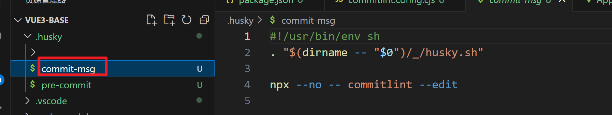

# 全新版本基础配置 less is more

> 由于vite脚手架要禁止\*.cjs 和 eslint版本升级废弃rc配置文件， 故重新搭建。
>
> 核心采用antfu大神预设配置 替代prettier和eslint设置，保留stylelint原因是暂时antfu不支持。

## 1 前置条件

### node版本

> node 最好>20 因为eslint9的需要 本次项目node为20.15.1


### 包管理器

> 包管理器 采用pnpm


### vscode 插件

> vscode 插件 eslint prettier stylelint unocss vue-official postcss


### git

> 安装官方git 用代码仓库管理

## 创建项目

> 用官方命令创建项目 然后清空项目

```js
pnpm create vue
```


## 配置.npmrc

> .npmrc是npm运行时配置文件，用于设置依赖包的安装来源。 https://pnpm.io/zh/npmrc

根目录新建 `.npmrc ` 以便于pnpm

```js
# 使用淘宝镜像源
registry = https://registry.npmmirror.com
# registry = https://registry.npmjs.org

# 根据需要提升含有以下的依赖包到根 node_modules 目录下
public-hoist-pattern[]=husky
public-hoist-pattern[]=*eslint*
public-hoist-pattern[]=@eslint*
public-hoist-pattern[]=*prettier*
public-hoist-pattern[]=lint-staged
public-hoist-pattern[]=*stylelint*
public-hoist-pattern[]=@commitlint*
public-hoist-pattern[]=core-js

# 提升所有依赖到根 node_modules 目录下，相当于 public-hoist-pattern[]=*，与上面一种方式一般二选一使用
# 极不推荐用这样的方式解决依赖问题，这样没有充分利用 pnpm 依赖访问安全性的优势，又走回了 npm / yarn 的老路。
# shamefully-hoist=true

enable-pre-post-scripts=true
engine-strict=true
package-manager-strict=false
```

## 强制使用pnpm & 限制node & pnpm版本

- package.json

```js

 "engines": {
    "node": "^18.18.0 || ^20.9.0 || >=21.1.0",
    "pnpm": ">=7.33.7"
  },
"scripts": {
    "preinstall": "npx only-allow pnpm",
   	// ...
  },
```

## prettier 【不采用】

### 依赖包

> "prettier": "^3.3.3",

### 安装

```js
pnpm i prettier -D
```

### 配置文件

- prettier.config.mjs

  ```js
  /**  @type {import('prettier').Config} */
  export default {
    $schema: "https://json.schemastore.org/prettierrc",
    semi: false,
    tabWidth: 2,
    singleQuote: true,
    printWidth: 100,
    trailingComma: "es5",
  };
  ```

## eslint【不采用】

> 使用9x版本 扁平化设计

1.  脚手架快速安装 然后pnpm i安装相关依赖包

```js
pnpm i create @eslint/config
```

2.  修改eslint.config.js 为eslint.config.mjs保持风格统一

### 安装

```js
# 额外安装
pnpm i eslint-define-config eslint-plugin-import -D
```

### 配置文件

- eslint.config.mjs

  ```js
  import globals from "globals";
  import pluginJs from "@eslint/js";
  import tseslint from "typescript-eslint";
  import pluginVue from "eslint-plugin-vue";
  import pluginImport from "eslint-plugin-import";
  import { defineFlatConfig } from "eslint-define-config";
  // 修复 https://eslint.nodejs.cn/blog/2024/05/eslint-compatibility-utilities/
  import { fixupPluginRules } from "@eslint/compat";

  export default defineFlatConfig([
    // 上面这一大截是官方的
    { files: ["**/*.{js,mjs,cjs,ts,vue}"] },
    pluginJs.configs.recommended,
    {
      languageOptions: { globals: globals.browser },
    },
    ...tseslint.configs.recommended,
    ...pluginVue.configs["flat/essential"],
    {
      files: ["**/*.vue"],
      languageOptions: {
        parserOptions: {
          parser: tseslint.parser,
        },
      },
    },
    // 这是引入顺序插件
    {
      files: ["**/*.vue", "**/*.?([cm])ts", "**/*.?([cm])tsx"],
      plugins: {
        // 修复插件还没升级到9版本
        import: fixupPluginRules(pluginImport),
      },
      rules: {
        // 插件还没升级到9x版本
        "import/first": "warn",
        "import/no-duplicates": "error",
        "import/order": [
          "error",
          {
            groups: [
              /* 
                builtin ：内置模块，如 path，fs等 Node.js内置模块。
                external ：外部模块，如 lodash ，react 等第三方库。
                internal ：内部模块，如相对路径的模块、包名前缀为 @ 的模块。
                unknown ：未知模块，如模块名没有指定扩展名或模块路径缺失扩展名。
                parent ：父级目录的模块。
                sibling ：同级目录的模块。
                index ：当前目录的 index 文件。
                object ：使用ES6 导入的模块。
                type ：使用 import type 导入的模块。
              */
              ["builtin", "external"],
              "internal",
              ["parent", "sibling"],
              "index",
              "type",
              "object",
              "unknown",
            ],
            pathGroups: [
              {
                pattern: "../**",
                group: "parent",
                position: "after",
              },
              {
                pattern: "./*.scss",
                group: "sibling",
                position: "after",
              },
            ],
            // 不同组之间是否换行。
            // 'newlines-between': 'always',
            // 根据字母顺序对每组内的引用进行排序。
            alphabetize: {
              order: "asc",
              caseInsensitive: true,
            },
          },
        ],
      },
    },
  ]);
  ```

## 2 styleLint 【采用】

> less和sass 推荐只选一个

### 依赖包

> "less": "^4.2.0",
>
> "postcss": "^8.4.41",
>
> "postcss-html": "^1.7.0",
>
> "postcss-less": "^6.0.0",
>
> "postcss-scss": "^4.0.9",
>
> "sass": "^1.77.8",
>
> "stylelint": "^16.8.2",
>
> "stylelint-config-recess-order": "^5.1.0",
>
> "stylelint-config-standard": "^36.0.1",

### 安装

```js
# 选择sass 可以选择不安装包含less相关 反之亦然
pnpm i less sass postcss postcss-html postcss-less postcss-scss sass stylelint stylelint-config-recess-order stylelint-config-standard -D
```

### 配置文件

- stylelint.config.mjs

  ```js
  /** @type {import('stylelint').Config} */
  export default {
    // stylelint-config-standard 基础配置
    // stylelint-config-recess-order 样式顺序
    extends: ["stylelint-config-standard", "stylelint-config-recess-order"],
    // 不同文件类型用不同解析器
    overrides: [
      {
        files: ["**/*.(css|html|vue)"],
        customSyntax: "postcss-html",
      },
      // 选less可以注释scss
      {
        files: ["*.less", "**/*.less"],
        customSyntax: "postcss-less",
      },
      // 选sass可以注释上面的less
      {
        files: ["*.scss", "**/*.scss"],
        customSyntax: "postcss-scss",
        rule: {
          "scss/percent-placeholder-pattern": null,
          "scss/at-mixin-pattern": null,
        },
      },
    ],
    rules: {
      // 'prettier/prettier': true,
      "media-feature-range-notation": null,
      "selector-not-notation": null,
      "import-notation": null,
      "function-no-unknown": null,
      "selector-class-pattern": null,
      "selector-pseudo-class-no-unknown": [
        true,
        {
          ignorePseudoClasses: ["global", "deep"],
        },
      ],
      "selector-pseudo-element-no-unknown": [
        true,
        {
          ignorePseudoElements: ["v-deep", ":deep"],
        },
      ],
      "at-rule-no-unknown": [
        true,
        {
          ignoreAtRules: [
            "tailwind",
            "apply",
            "variants",
            "responsive",
            "screen",
            "function",
            "if",
            "each",
            "include",
            "mixin",
            "extend",
            "use",
          ],
        },
      ],
      "no-empty-source": null,
      "named-grid-areas-no-invalid": null,
      "no-descending-specificity": null,
      "font-family-no-missing-generic-family-keyword": null,
      "rule-empty-line-before": [
        "always",
        {
          ignore: ["after-comment", "first-nested"],
        },
      ],
      "unit-no-unknown": [true, { ignoreUnits: ["rpx"] }],
      "order/order": [
        [
          "dollar-variables",
          "custom-properties",
          "at-rules",
          "declarations",
          {
            type: "at-rule",
            name: "supports",
          },
          {
            type: "at-rule",
            name: "media",
          },
          "rules",
        ],
        { severity: "error" },
      ],
    },
    ignoreFiles: ["**/*.js", "**/*.jsx", "**/*.tsx", "**/*.ts"],
  };
  ```

### 新增脚本

- package.json

  ```js
  {
      "scripts": {
          // ...
          "lint:stylelint": "stylelint  \"**/*.{css,scss,less,vue,html}\" --fix"
      }
  }
  ```

### 忽略文件

- .stylelintignore

  ```js
  /dist/*
  /public/*
  ```

## 3 antfu 组合prettier&eslint 【采用】

> 配置网站 https://github.com/antfu/eslint-config/tree/feat/support-eslint-9?tab=readme-ov-file
>
> 先选一个unocss 免得后续再去安装unocss的@unocss/eslint-plugin

### 命令行界面 (CLI) 安装

> 空格选择 回车下一步

```js
npx @antfu/eslint-config@latest
```


### 安装依赖包

> "@antfu/eslint-config": "^2.27.3",
>
> "eslint": "^9.9.1",
>
> "eslint-plugin-format": "^0.1.2",
>
> "@unocss/eslint-plugin": "^0.62.3",

```js
pnpm i
```

### 配置文件

> 修改生成配置文件eslint.config.js为eslint.config.mjs 用于eslint规则校验

- eslint.config.mjs

  ```js
  import antfu from "@antfu/eslint-config";

  export default antfu({
    // @stylistic/eslint-plugin-plus
    stylistic: true,
    // eslint-plugin-format
    formatters: true,
    // unocss 检测&格式化 暂时注释 等配置了unocss再开放为true
    // unocss: true,
    // vue的eslint配置
    vue: true,
    // 保存删除未引入的代码
    // isInEditor: false,
    // 9x版本 忽略文件这种配置方式 废弃掉eslintignore
    ignores: [
      "*.sh",
      "node_modules",
      "*.md",
      "*.woff",
      "*.ttf",
      ".idea",
      "/public",
      "/docs",
      ".husky",
      ".local",
      "/bin",
      "Dockerfile",
    ],
  });
  ```

### 新增脚本

- package.json

```js
{
    "scripts": {
       // ...
      "lint": "eslint .",
      "lint:fix": "eslint . --fix"
    }
  }
```

### .vscode 配置文件

> 用于保存带代码格式化

- 生成.vscode/setting.json 修改为

  ```js
  {
    "typescript.tsdk": "./node_modules/typescript/lib",
    // "npm.packageManager": "pnpm",
    // "editor.formatOnSave": true,
    "editor.tabSize": 2,
    "editor.defaultFormatter": "esbenp.prettier-vscode",
    // 保存文件缓慢时，可以考虑开启以下 3 行配置。
    "vue.server.maxOldSpaceSize": 4096,
    "vue.server.hybridMode": true,
    "typescript.tsserver.maxTsServerMemory": 4096,
    "files.eol": "\n",
    "editor.guides.bracketPairs": true,
    "editor.bracketPairColorization.enabled": true,
    "vue.inlayHints.missingProps": true,
    "vue.autoInsert.dotValue": true,
    "explorer.copyRelativePathSeparator": "/",
    "search.exclude": {
      "**/node_modules": true,
      "**/*.log": true,
      "**/*.log*": true,
      "**/bower_components": true,
      "**/dist": true,
      "**/elehukouben": true,
      "**/.git": true,
      "**/.gitignore": true,
      "**/.svn": true,
      "**/.DS_Store": true,
      "**/.idea": true,
      "**/.vscode": false,
      "**/pnpm i.lock": true,
      "**/tmp": true,
      "out": true,
      "dist": true,
      "node_modules": true,
      "CHANGELOG.md": true,
      "examples": true,
      "res": true,
      "screenshots": true,
      "pnpm i-error.log": true,
      "**/.pnpm i": true
    },
    "files.exclude": {
      "**/.cache": true,
      "**/.editorconfig": true,
      "**/.eslintcache": true,
      "**/bower_components": true,
      "**/.idea": true,
      "**/tmp": true,
      "**/.git": true,
      "**/.svn": true,
      "**/.hg": true,
      "**/CVS": true,
      "**/.DS_Store": true
    },
    "files.watcherExclude": {
      "**/.git/objects/**": true,
      "**/.git/subtree-cache/**": true,
      "**/.vscode/**": true,
      "**/node_modules/**": true,
      "**/tmp/**": true,
      "**/bower_components/**": true,
      "**/dist/**": true,
      "**/pnpm i.lock": true
    },
    "eslint.useFlatConfig": true,
    "stylelint.enable": true,
    "stylelint.validate": ["css", "less", "postcss", "scss", "vue", "sass"],
    "path-intellisense.mappings": {
      "@/": "${workspaceRoot}/src"
    },
    "i18n-ally.localesPaths": ["src/locales/lang"],
    "i18n-ally.keystyle": "nested",
    "i18n-ally.sortKeys": true,
    "i18n-ally.namespace": true,
    "i18n-ally.pathMatcher": "{locale}/{namespaces}.{ext}",
    "i18n-ally.enabledParsers": ["json"],
    "i18n-ally.sourceLanguage": "en",
    "i18n-ally.displayLanguage": "zh-CN",
    "i18n-ally.enabledFrameworks": ["vue", "react"],
    // Disable the default formatter, use eslint instead
    "prettier.enable": false,
    "editor.formatOnSave": false,

    // Auto fix
    "editor.codeActionsOnSave": {
      "source.fixAll.eslint": "explicit",
      "source.organizeImports": "never",
      "source.fixAll.stylelint": "explicit"
    },

    // Silent the stylistic rules in you IDE, but still auto fix them
    "eslint.rules.customizations": [
      { "rule": "style/*", "severity": "off", "fixable": true },
      { "rule": "format/*", "severity": "off", "fixable": true },
      { "rule": "*-indent", "severity": "off", "fixable": true },
      { "rule": "*-spacing", "severity": "off", "fixable": true },
      { "rule": "*-spaces", "severity": "off", "fixable": true },
      { "rule": "*-order", "severity": "off", "fixable": true },
      { "rule": "*-dangle", "severity": "off", "fixable": true },
      { "rule": "*-newline", "severity": "off", "fixable": true },
      { "rule": "*quotes", "severity": "off", "fixable": true },
      { "rule": "*semi", "severity": "off", "fixable": true }
    ],
    "css.validate": false,
    "less.validate": false,
    "scss.validate": false,
    // Enable eslint for all supported languages
    "eslint.validate": [
      "javascript",
      "javascriptreact",
      "typescript",
      "typescriptreact",
      "vue",
      "html",
      "markdown",
      "json",
      "jsonc",
      "yaml",
      "toml",
      "xml",
      "gql",
      "graphql",
      "astro",
      "css",
      "less",
      "scss",
      "pcss",
      "postcss"
    ]
  }

  ```

## 4 代码提交检查

Husky + Lint-staged + Commitlint + Commitizen + cz-git 来配置 Git 提交代码规范。

> 核心内容是配置 Husky 的 pre-commit 和 commit-msg 两个钩子:
>
> pre-commit：Husky + Lint-staged 整合实现 Git 提交前代码规范检测/格式化 (前提：ESlint + Prettier + Stylelint 代码统一规范)；
>
> commit-msg: Husky + Commitlint + Commitizen + cz-git 整合实现生成规范化且高度自定义的 Git commit message。

### husky

Husky 是 Git 钩子工具，可以设置在 git 各个阶段（`pre-commit`、`commit-msg` 等）触发。

官网https://typicode.github.io/husky 推荐安装指令

- 1 前提条件 项目有.git 如果没有需要生成 有git的话不需要这一步

  ```js
  git init
  ```

- 2 自动配置husky

  ```js
  npx husky-init
  ```

  

- 3 安装husky 执行pnpm i

  ```js
  pnpm i
  ```

  

### Lint-staged 增量检测提交代码

lint-staged 是一个在 git add 到暂存区的文件运行 linters (ESLint/Prettier/StyleLint) 的工具，避免在 git commit 提交时在整个项目执行。

- 1 安装

  ```js
  pnpm i lint-staged -D
  ```

- 2 新建lint-staged.config.mjs 配置文件

  ```js
  /**  @type {import('lint-staged').Config} */
  export default {
    "*.{js,jsx,ts,tsx}": ["eslint --fix"],
    "*.json": ["eslint --fix"],
    "*.vue": ["eslint --fix"],
    "*.{scss,less,styl,html}": ["stylelint --fix --allow-empty-input"],
    "*.md": ["prettier --write"],
  };
  ```

- 3 文件`.husky/pre-commit`**修改提交前钩子命令**

  npx命令会自动执行安装过的 lint-staged插件，从而执行lint-staged.config.mjs配置文件

  ```js
  #!/usr/bin/env sh
  . "$(dirname -- "$0")/_/husky.sh"

  npx lint-staged
  ```

  

### Commitlint

Commitlint 检查您的提交消息是否符合 Conventional commit format。-- [Commitlint 官网](https://commitlint.js.org/)

- 1 安装

  ```js
  pnpm i @commitlint/cli @commitlint/config-conventional -D
  ```

- 2 根目录创建 `commitlint.config.mjs` 配置文件

  ```js
  /** @type {import("@commitlint/types").UserConfig} */
  export default {
    ignores: [(commit) => commit.includes("init")],
    extends: ["@commitlint/config-conventional"],
    rules: {
      "body-leading-blank": [2, "always"],
      "footer-leading-blank": [1, "always"],
      "header-max-length": [2, "always", 108],
      "subject-empty": [2, "never"],
      "type-empty": [2, "never"],
      "subject-case": [0],
      "type-enum": [
        2,
        "always",
        [
          "feat", // 新增功能
          "fix", // 修复缺陷
          "docs", // 文档变更
          "style", // 代码格式（不影响功能，例如空格、分号等格式修正）
          "refactor", // 代码重构（不包括 bug 修复、功能新增）
          "perf", // 性能优化
          "test", // 添加疏漏测试或已有测试改动
          "build", // 构建流程、外部依赖变更（如升级 npm 包、修改 webpack 配置等）
          "ci", // 修改 CI 配置、脚本
          "revert", // 回滚 commit
          "chore", // 对构建过程或辅助工具和库的更改（不影响源文件、测试用例）
        ],
      ],
    },
  };
  ```

- 3 执行下面命令生成 `commint-msg` 钩子用于 git 提交信息校验

  ```js
  npx husky add .husky/commit-msg "npx --no -- commitlint --edit $1"
  ```

  
